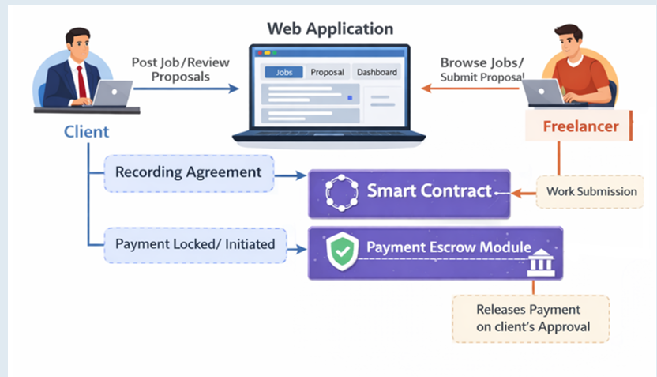

# FreelanceChain

A decentralized freelancing platform that connects clients and freelancers through blockchain technology. The platform helps manage project postings, freelancer assignments, work completion, and feedback in a transparent and secure environment using smart contracts.

---

## Overview

FreelanceChain was developed to simplify the interaction between clients and freelancers by leveraging blockchain technology. Traditional freelancing platforms often rely on centralized systems for managing projects and payments. This project explores how smart contracts can be used to automate project workflows while maintaining transparency between both parties.

The platform allows clients to post jobs, freelancers to participate in projects, and both parties to track project progress through a user-friendly interface connected to the Ethereum blockchain.

---

## Features

* Client and Freelancer dashboards
* Create and manage freelance projects
* Assign freelancers to projects
* Smart contract-based project management
* Wallet integration using MetaMask
* Track project status and completion
* Freelancer performance statistics
* Freelancer rating system
* Responsive and user-friendly interface

---

## Tech Stack

| Layer             | Technologies             |
| ----------------- | ------------------------ |
| Frontend          | HTML, CSS, JavaScript    |
| Blockchain        | Ethereum Sepolia Testnet |
| Smart Contracts   | Solidity                 |
| Web3 Integration  | Ethers.js                |
| Wallet            | MetaMask                 |
| Development Tools | VS Code, Remix IDE       |

---

## System Flow

1. A client connects their wallet to the platform.
2. The client creates a new project.
3. A freelancer is assigned to the project.
4. Project details are stored and managed through the smart contract.
5. The freelancer completes the assigned work.
6. The client approves the completed project.
7. The client provides a rating and feedback for the freelancer.
8. Freelancer statistics are updated automatically.

---
### System Architecture



## Smart Contract

The FreelanceChain smart contract handles:

* Project creation
* Freelancer assignment
* Project status management
* Work approval process
* Rating storage
* Freelancer performance tracking

The contract is deployed on the Ethereum Sepolia Test Network for testing and demonstration purposes.

---

## Setup Instructions

### 1. Clone the Repository

```bash
git clone https://github.com/inshirah1243/FreelanceChain.git
cd FreelanceChain
```

### 2. Open the Project

Open the project folder in Visual Studio Code.

### 3. Configure MetaMask

* Install MetaMask extension
* Connect to the Ethereum Sepolia Test Network
* Import a test account if required

### 4. Run the Application

Simply open:

```bash
index.html
```

or use the VS Code Live Server extension.

---

## Project Structure

```text
FreelanceChain/
│
├── src/
├── index.html
├── client.html
├── freelancer.html
├── style.css
└── script.js
```

---

## Outputs

Below are sample outputs captured from the application during runtime.


---


---


---


---


---


---


---

---

## Future Improvements

1. Add an in-platform messaging system for client and freelancer communication.
2. Support multiple freelancer applications for a single project.
3. Improve project tracking with milestone-based workflows.
4. Add document sharing and project attachment support.
5. Deploy the platform on a production blockchain network for real-world usage.

---

## Contributors

* Inshirah Ibtihaz- [GitHub](https://github.com/inshirah1243)


---

This project was developed for academic and learning purposes. It uses the Ethereum Sepolia Test Network and does not involve real financial transactions.
